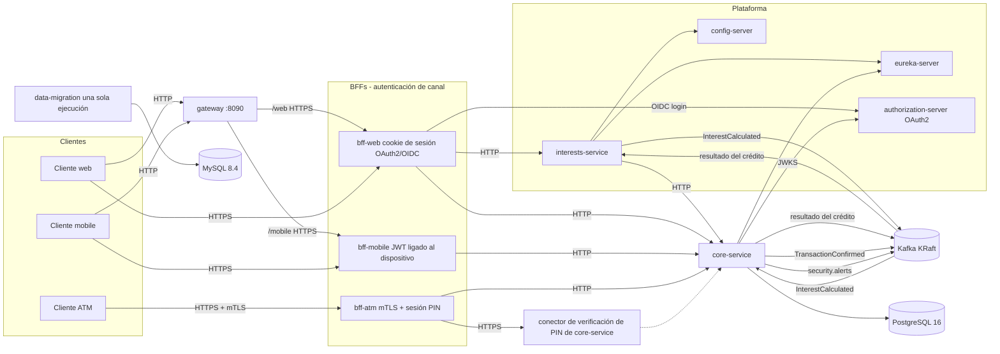
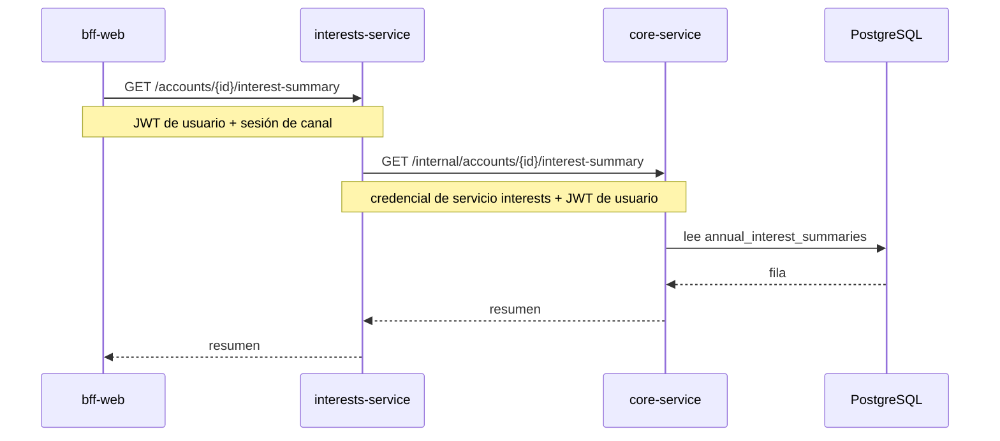
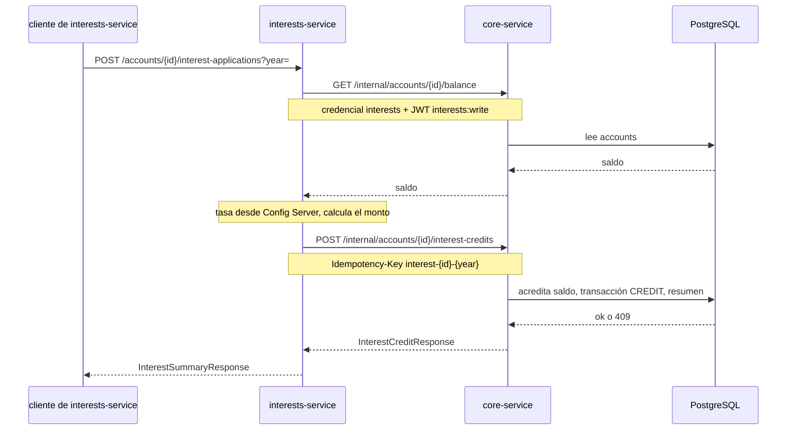
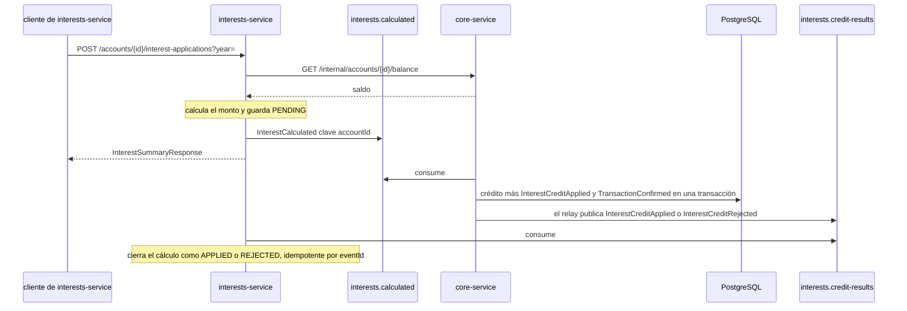
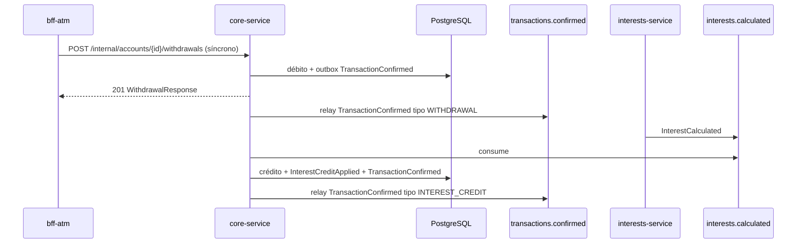

# Arquitectura

XYZ Bank expone tres backends por canal (BFF) delante de una plataforma interna: `core-service` (único dueño de PostgreSQL), más `config-server`, `eureka-server` e `interests-service` para el cálculo y el corte anual de intereses. Un único broker Apache Kafka en modo KRaft transporta la saga de acreditación de intereses. El job de saneamiento de los CSV legados escribe reportes en una instancia MySQL aparte; esos reportes no se cargan en las tablas de `core-service`.

## Topología

Un `gateway` escucha en el puerto **8090** y queda delante de los tres BFF. Enruta `/web` hacia `bff-web`, `/mobile` hacia `bff-mobile` y `/atm` hacia `bff-atm`, y quita ese prefijo antes de reenviar. Cada canal prueba quién llama con una credencial real, no con una cabecera de confianza: cookie de sesión OAuth2/OIDC en web, JWT ligado al dispositivo en mobile, y mTLS más una sesión verificada por PIN en ATM. Los tres BFF sirven TLS hacia el cliente; el `gateway` escucha en HTTP en desarrollo y reenvía por HTTPS a `bff-web` y `bff-mobile`, confiando en la CA de desarrollo que firma sus certificados (`TLS_TRUSTED_CA_PATH`). El cajero se conecta directo a `bff-atm`, porque ese canal autentica al terminal con su propio certificado de cliente (mTLS). El borde BFF → plataforma sigue en HTTP plano, salvo la única llamada que lleva el PIN en claro, que es solo TLS por diseño.

`core-service` abre, cierra y mantiene cuentas, acepta depósitos, transferencias y pagos externos, y actualiza el nombre y el correo del cliente. El GET de saldo no cambia. Una cuenta cerrada no acepta movimientos. El retiro del ATM tampoco cambia.

Gestión de cuentas, gestión de clientes y procesamiento de pagos son servicios de dominio separados dentro de `core-service`: cada uno tiene sus casos de uso, controladores y repositorios (paquetes `accounts` y `payments`, con el dominio en `core-domain`). Se despliegan juntos porque un depósito o una transferencia debe modificar saldo, movimiento y outbox en una sola transacción de PostgreSQL. `interests-service` muestra el camino de extracción a un proceso propio (Config Server, Eureka, LoadBalancer, Resilience4j y Kafka); el mismo camino aplica a cuentas, clientes y pagos cuando se acepte consistencia eventual entre ellos.

Resiliencia de las llamadas HTTP salientes: `interests-service` → `core-service` (resumen, saldo y crédito) y el historial de transacciones de `bff-web` usan circuit breaker y retry de Resilience4j, con fallback en `interests-service`. Las demás llamadas de los BFF a `core-service` tienen timeouts de conexión y lectura de 3 s.

`bff-web` enruta el tráfico de resumen de intereses a `interests-service` (la flag está encendida por defecto). Mobile y ATM siguen hablando con `core-service` directo. `interests-service` carga la configuración desde `config-server`, se registra en Eureka, descubre `core-service` por id de servicio (LoadBalancer) y envuelve las llamadas HTTP salientes a core con un circuit breaker de Resilience4j. El GET del resumen anual de intereses sigue síncrono y reenvía el bearer del usuario. La acreditación de intereses se queda en ese camino HTTP mientras `FEATURE_INTEREST_CREDIT_VIA_KAFKA` es `false` (el default): `interests-service` se autentica con su credencial de servicio y el scope JWT `interests:write`. Con la flag en `true`, el mismo cálculo se publica como `InterestCalculated` y `core-service` acredita la cuenta y luego publica el resultado. Registro de la decisión: [`docs/adr/002-event-architecture.md`](adr/002-event-architecture.md).

Cuando la verificación de PIN bloquea una tarjeta que estaba desbloqueada, `core-service` publica `CardBlocked` en el tópico `security.alerts`. El evento no incluye el PIN. La flag es `FEATURE_SECURITY_ALERTS` (`false` en la aplicación, `true` en Compose).

El conector de verificación de PIN de `core-service` (`CoreServicePin` arriba) es un segundo conector Tomcat del mismo servicio, no un artefacto aparte: comparte el proceso y el acceso a base de datos de `core-service`. Se dibuja aparte solo para mostrar que ese conector termina TLS, mientras el resto de los endpoints de `core-service` siguen en HTTP plano.

Lo que no cambia según el canal: un BFF por canal, `core-service` como único dueño de la base de las entidades bancarias, MySQL reservado a los reportes de migración, y los contratos de payload que ya tenían los BFF. Qué prueba la credencial de cada canal y cómo se valida está en `docs/contracts/*/openapi.yaml`. Kafka coordina el crédito de intereses cuando la flag está encendida. No es dueño del estado de la cuenta. `security.alerts` avisa el bloqueo de una tarjeta; tampoco mueve saldo. Hoy `core-service` consume `security.alerts` para registrar cada alerta; `transactions.confirmed` queda publicado para consumidores futuros (auditoría, notificaciones, analítica) sin cambiar el productor.

## Flujos de intereses

### Consulta — resumen anual de intereses

### Comando — aplicar interés anual (HTTP, por defecto)

`FEATURE_INTEREST_CREDIT_VIA_KAFKA=false`. Es el camino con el que arranca Compose y el que ejercitan los tests de punta a punta actuales.

El bloqueo optimista de `accounts.version` y el único `(account_id, year)` de los resúmenes impiden una doble aplicación. Repetir la misma `Idempotency-Key` reproduce el crédito original. Las llamadas salientes de `interests-service` a `core-service` usan circuit breaker y retry de Resilience4j: si core falla seguido, el breaker se abre y la llamada falla rápido. Con la flag de Kafka encendida, `creditInterest` no se llama, así que ese breaker ya no cubre el crédito. `fetchInterestSummary` y `fetchAccountBalance` siguen en él.

### Comando — aplicar interés anual (saga Kafka)

`FEATURE_INTEREST_CREDIT_VIA_KAFKA=true`. El POST devuelve el resumen calculado en cuanto se publica `InterestCalculated`. El cálculo queda `PENDING` en el repositorio en memoria hasta que `interests.credit-results` lo cierra. El endpoint HTTP de crédito sigue disponible para el camino con la flag apagada.

La clave de partición es `accountId`. La entrega es at-least-once. El `eventId` es `interest:{accountId}:{year}`. La clave de idempotencia HTTP del camino síncrono sigue siendo `interest-{accountId}-{year}`. Un `eventId` duplicado no acredita el saldo dos veces. Si la transacción del crédito falla, no queda fila en el outbox. Un rechazo de negocio (`VALIDATION`, `NOT_FOUND` o `CONFLICT`) publica `InterestCreditRejected` con `reason`, no cambia el saldo y confirma el offset del consumidor para no bloquear la partición. Con la flag de Kafka apagada, un crédito HTTP no escribe filas de outbox de resultado de interés. `core-service` es el único servicio con outbox, porque es el único con una transacción local de base alrededor del crédito. Ver [`docs/adr/002-event-architecture.md`](adr/002-event-architecture.md).

### Evento — TransactionConfirmed (cada movimiento de dinero confirmado)

Cuando `FEATURE_TRANSACTION_CONFIRMED_EVENTS` está encendida, cada retiro confirmado y cada crédito de interés confirmado escribe una fila `TransactionConfirmed` en el mismo outbox transaccional de la saga de intereses. El relay del outbox la publica en `transactions.confirmed` con clave de partición `accountId`. El contrato HTTP del retiro ATM no cambia: el evento es un efecto lateral de `persistWithdrawal`. Un reintento idempotente del retiro no inserta un segundo evento. Un retiro rechazado o un crédito de interés rechazado no inserta `TransactionConfirmed`.

Payload de `TransactionConfirmed`: `eventId` (id de la transacción), `eventType`, `schemaVersion`, `accountId`, `type` (`WITHDRAWAL` | `INTEREST_CREDIT`), `amount`, `currency`, `occurredAt`. No lleva número de tarjeta, PIN, datos personales del cliente ni id de terminal ATM.
